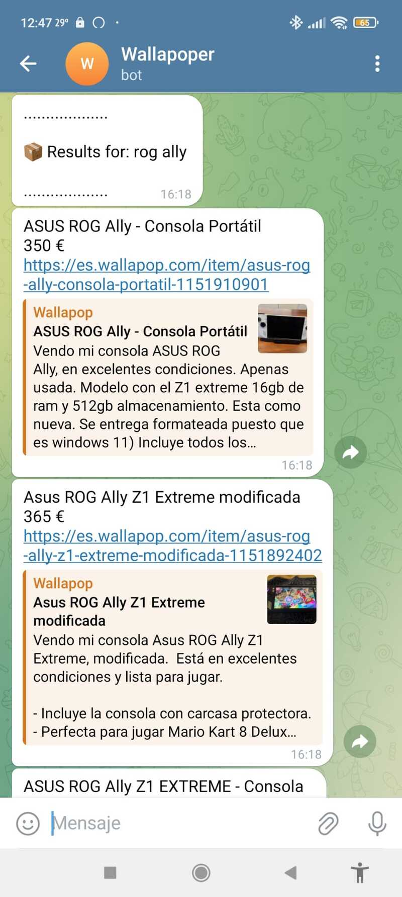

# 🤖 Wallapop Deal Tracker with Telegram Alerts

A Python-based bot that automatically monitors Wallapop listings and sends new deal alerts directly to your Telegram chat.  
It uses **Playwright** for browsing and **Telegram Bot API** for notifications.

---

## 📌 What Is This?

This project is a script that:

- Searches **Wallapop** periodically for user-defined products.
- Filters results based on **keyword** and **price range**.
- Sends real-time alerts to a **Telegram chat** with title, price, and link.

---

## 💡 Why Use This?

Wallapop is fast-moving, and the best deals go quickly.  
This bot gives you a competitive edge by:

- Automating your product hunt.
- Sending instant alerts to Telegram.
- Supporting **multiple search configurations**.
- Being completely **free and open-source** (GPLv3 licensed).

---

## ⚙️ How to Use

1. **Install requirements**  
   ```bash
   pip install -r requirements.txt
   ```

2. **Configure your bot**  
   - Create a Telegram bot via [@BotFather](https://t.me/BotFather).
   - Get your Telegram **bot token** and **chat ID**.
   - Modify `data.json` with your preferences:

   ```json
   {
     "configurations": [
       {
         "keywords": "steam deck oled",
         "min": 100,
         "max": 350
       },
       {
         "keywords": "rog ally",
         "min": 100,
         "max": 400
       }
     ],
     "time": 5,
     "telegram_token": "YOUR_TELEGRAM_BOT_TOKEN",
     "telegram_chat_id": "YOUR_TELEGRAM_CHAT_ID"
   }
   ```

3. **Run the bot**  
   ```bash
   python wallapop_alerta.py
   ```

---

## 📸 Screenshots

| Script Running | Telegram Alerts |
|----------------|-----------------|
|  |  |


---

## ⚠️ Disclaimer

- Using bots with Telegram may **violate their terms of service**. Use at your own risk.
- This script works as of **July 14, 2025**, but **Wallapop's website structure may change**, which can break the scraping logic.
- The developer is not responsible for misuse or platform bans.

---

## 📜 License

This project is licensed under the **GNU General Public License v3.0 (GPL-3.0)**.  
Feel free to modify and distribute, but keep it open-source.

---

## 🙌 Contributions

Feel free to fork, improve, or report issues via GitHub!